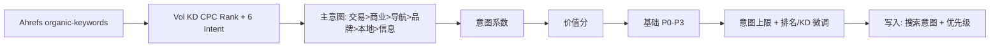

# 站点关键词库 · 分级评分方案（仅 Ahrefs 搜索意图）

**版本**：2026-06-03 v2（已实现：`script/keyword_grading.py` + `script/sync.py`）  
**依据**：`keyword-classifiation.docx`（价值分公式）+ Ahrefs Intent + 明道云 `keyword_intent_option_keys`  
**原则**：**不再使用** 产品词 / 工艺词 / 应用词 / 材质词 / 询盘词 分类；**只按 Ahrefs 六类搜索意图** 分类、算系数、联动优先级。

---

## 1. 与现表字段的关系


| 字段                               | 本方案                                    |
| -------------------------------- | -------------------------------------- |
| 关键词 / 搜索量 / KD / 排名 / 落地页 / 数据日期 | Ahrefs 同步，不变                           |
| **搜索意图**（建议正式启用）                 | **唯一分类维度**：六类 Intent，由 API 写入          |
| **关键词类型**（产品/工艺/应用/材质/询盘）        | **本方案不使用**；可保留列给人工备注，或后续从表结构移除         |
| **优先级**                          | 由 **价值分 + 搜索意图 + 排名规则** 推荐 P0～P3 / 未分级 |
| 优化状态 / 关联落地页                     | 人工，不参与自动分级                             |


---

## 2. 价值分公式（沿用原文档）


| 符号                  | 来源                       |
| ------------------- | ------------------------ |
| Vol（月均搜索量）          | `volume`                 |
| KD                  | `keyword_difficulty`     |
| CPC（Cost Per Click） | `cpc`（无则 0 或默认 0.5，报告标注） |
| **意图系数**            | 由 **搜索意图（主意图）** 决定，见 §3  |


```text
价值分 = ((Vol / 1000 × 60) + (CPC × 80)) × 意图系数 / (KD + 20) × 100
```

---

## 3. 搜索意图：只认 Ahrefs 六类

### 3.1 API 与明道云选项（一一对应）


| 搜索意图（明道云单选） | Ahrefs 字段          |
| ----------- | ------------------ |
| 交易类         | `is_transactional` |
| 商业/比价类      | `is_commercial`    |
| 导航/找品牌      | `is_navigational`  |
| 品牌词         | `is_branded`       |
| 本地类         | `is_local`         |
| 信息类         | `is_informational` |


配置见 `config/mingdao_options.json` → `keyword_intent_option_keys`。

### 3.2 多个 Intent 同时为 true 时：定「主意图」

**只保留一条**，按 B2B SEO 价值从高到低（与你指定的顺序一致）：

```text
交易类  >  商业/比价类  >  导航/找品牌  >  品牌词  >  本地类  >  信息类
```

实现逻辑：从上到下检查 Ahrefs 布尔值，**第一个为 true 的** 即主意图。  
写入明道云 **搜索意图** 字段 = 该主意图（不再推导其它类型标签）。

### 3.3 主意图 → 意图系数（替代原 Type 1.5/1.2/1.0）

对齐原文档「核心业务 / 工艺扩展 / 泛信息」三档，**直接挂在 Intent 上**：


| 搜索意图       | 意图系数    | 说明                       |
| ---------- | ------- | ------------------------ |
| **交易类**    | **1.5** | 最接近转化 / 询盘               |
| **商业/比价类** | **1.5** | 供应商、比价、方案对比              |
| **导航/找品牌** | **1.0** | 品牌导航，一般不单独冲排名            |
| **品牌词**    | **1.0** | 品牌词；优先级另有上限（§4.1）        |
| **本地类**    | **1.1** | 地域需求；非主战场可略低于商业          |
| **信息类**    | **1.0** | 科普、原理、how to；控制 P0/P1 占比 |


> 不再根据英文词根判断「材质/工艺/应用」；若 Ahrefs 标成商业类，即按商业类计分。

---

## 4. 价值分 → 优先级（P0～P3 / 未分级）


| 价值分                | 建议优先级   | 运营含义    |
| ------------------ | ------- | ------- |
| **≥ 70**           | **P0**  | 核心攻坚    |
| **50～69**          | **P1**  | 重点拓展    |
| **30～49**          | **P2**  | 长尾/内容排期 |
| **15～29**          | **P3**  | 低优先、仅监控 |
| **< 15** 或缺 Vol/KD | **未分级** | 暂不投入    |


### 4.1 按「主意图」的优先级上限（与系数分开）

在分值档基础上，再套 **意图天花板**（取更严的一档）：


| 主意图        | 优先级上限     | 原因                        |
| ---------- | --------- | ------------------------- |
| 交易类、商业/比价类 | 无额外上限     | 可进 P0                     |
| 导航/找品牌、品牌词 | **最高 P2** | 品牌流量，少占 P0/P1 编制          |
| 本地类        | **最高 P2** | 视站点是否做本地市场；全球 B2B 站默认 cap |
| 信息类        | **最高 P2** | 原文档：控制信息词在核心词中占比          |


### 4.2 排名 / KD 微调（与 v1 相同思路）


| 条件                | 调整               |
| ----------------- | ---------------- |
| 排名 ≤10 且价值分 ≥50   | 不强行 P0，建议 **P1** |
| 排名 >30 且价值分 ≥70   | **P0**（待攻坚）      |
| KD > 60 且未进 Top30 | **降 1 档**        |
| Vol < 20          | **最高 P3**        |
| 缺 Vol 或 KD        | **未分级**          |


---

## 5. 自动化流程




**写入策略（建议）**：


| 字段            | 策略                                       |
| ------------- | ---------------------------------------- |
| **搜索意图**      | 每次 sync **覆盖**（以 Ahrefs 主意图为准）           |
| **优先级**       | 仅当当前为 **未分级** 时自动写入；人工已设 P0～P3 则 **不覆盖** |
| **关键词类型**     | **不写入**（本方案废弃）                           |
| **价值分**（可选新列） | 每次 sync 覆盖，便于筛选                          |


---

## 6. 算例

**词**：`custom cnc machining service`  
**Ahrefs**：Vol=500，KD=38，CPC=3.2；`is_commercial=true`（且无更高优先级 Intent）→ **主意图=商业/比价类**，意图系数=**1.5**

```text
价值分 ≈ ((30+256)×1.5)/58×100 ≈ 73.9  → 基础 P0
```

若同时 `is_transactional=true` → 主意图升格为 **交易类**，系数仍为 1.5。

---

## 7. 明道云字段建议


| 动作                | 说明                                      |
| ----------------- | --------------------------------------- |
| **启用「搜索意图」列**     | 单选，六选项与 `keyword_intent_option_keys` 一致 |
| **停用自动维护「关键词类型」** | 产品/工艺/应用/材质/询盘 不再参与本流程                  |
| **优先级**           | P0 / P1 / P2 / P3 / 未分级                 |
| **可选「价值分」**       | 数值 0～100                                |


---

## 8. 看板与考核

- 看板 Top 分档：仍统计 **全部有机词**，与搜索意图无关。  
- 周会 KPI 建议：**主意图 ∈ {交易类, 商业/比价类} 且 优先级=P0/P1 且 排名>30**。  
- 信息类 / 品牌类：单独视图，不纳入「必攻词」总数。

---

## 9. 后续开发（确认方案后）

1. API `select` 增加 Intent 布尔 + `cpc`
2. 实现 `resolve_primary_intent()`（固定六档优先级）
3. 实现 `score_keyword()` + `assign_priority()`
4. sync 写 **搜索意图**、**优先级**（及可选价值分），**不写关键词类型**

---

## 10. 摘要


| 问题           | 答案                                              |
| ------------ | ----------------------------------------------- |
| 还分询盘/产品/工艺吗？ | **不分**，已去掉                                      |
| 分类依据？        | **仅 Ahrefs 六类搜索意图**；多选时按 交易>商业>导航>品牌>本地>信息 取主意图 |
| 和原 Excel 公式？ | **相同**，D 列改为 **意图系数**（由主意图查表）                   |
| 关键词类型列？      | **不参与**；可留给人工或以后删列                              |


---

*文档结束。确认后改 `sync.py` 与明道云表结构。*