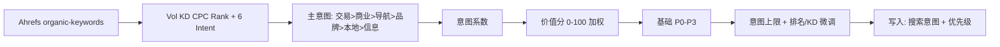

# 站点关键词库 · 分级评分方案（仅 Ahrefs 搜索意图）

**版本**：2026-06-03 v3（价值分 0～100 加权；已实现：`script/keyword_grading.py` + `script/sync.py`）  
**依据**：`keyword-classifiation.docx`（原 Vol/CPC 权重思路）+ Ahrefs Intent + 明道云 `keyword_intent_option_keys`  
**原则**：**不再使用** 产品词 / 工艺词 / 应用词 / 材质词 / 询盘词 分类；**只按四类搜索意图**（交易 / 商业 / 导航 / 信息）分类、算系数、联动优先级。

---

## 1. 与现表字段的关系


| 字段                               | 本方案                                    |
| -------------------------------- | -------------------------------------- |
| 关键词 / 搜索量 / KD / 排名 / 落地页 / 数据日期 | Ahrefs 同步，不变                           |
| **搜索意图**                         | **唯一分类维度**：四类 Intent，由 API 写入          |
| **关键词类型**（产品/工艺/应用/材质/询盘）        | **本方案不使用**；可保留列给人工备注，或后续从表结构移除         |
| **优先级**                          | 由 **价值分 + 搜索意图 + 排名规则** 推荐 P0～P3 / 未分级 |
| 优化状态 / 关联落地页                     | 人工，不参与自动分级                             |


---

## 2. 价值分公式（0～100 加权，v3）

在原文档「搜索量 + CPC 加权、KD 打折、意图放大」思路上，改为 **分项满分 + 封顶 100**，便于与明道云「0～100 分」列一致。

| 符号 | 来源 |
|------|------|
| Vol（月均搜索量） | `volume` |
| KD | `keyword_difficulty` |
| CPC（美元） | Ahrefs `cpc`（**美分**）÷ 100；无则 **0.5** |
| **意图系数** | 主意图查表，见 §3 |

```text
搜索量分 = min(40, Vol / 1000 × 40)          ← 每 1000 月搜最多贡献 40 分
CPC分    = min(35, CPC美元 × 10)             ← 约 $3.5 买满 CPC 维度 35 分
KD折扣   = 20 / (KD + 20)                    ← KD 越高折扣越大（0～1）
价值分   = min(100, (搜索量分 + CPC分) × 意图系数 × KD折扣)
```

| 维度 | 满分 | 说明 |
|------|------|------|
| 搜索量 | **40** | 体量；1000 月搜 ≈ 打满该维 |
| CPC | **35** | 商业化；与旧式 `×80` 同向，按美元线性封顶 |
| 意图系数 | 乘数 | 见 §3（交易/商业 1.5 等） |
| KD | 乘数折扣 | 等价于旧式除以 `(KD+20)`，再与上两项合成 |
| **合计** | **≤100** | 写入明道云保留 2 位小数 |

> 旧 Excel 式 `((Vol/1000×60)+(CPC×80))×系数/(KD+20)×100` 已停用（易产生数千分）；**P0/P1/P2/P3 档位阈值（70/50/30/15）不变**。

---

## 3. 搜索意图：四类（明道云单选）

### 3.1 API 与明道云选项（一一对应）

| 搜索意图（明道云） | Ahrefs 主字段 |
|------------|---------------|
| 交易类 | `is_transactional` |
| 商业类 | `is_commercial` |
| 导航类 | `is_navigational` |
| 信息类 | `is_informational` |

配置见 `config/mingdao_options.json` → `keyword_intent_option_keys`。

Ahrefs 若仅标 **品牌** / **本地**（无上述四类）：脚本映射为 **导航类** / **商业类**。

### 3.2 多个 Intent 同时为 true：定「主意图」

```text
交易类  >  商业类  >  导航类  >  信息类
```

从上到下检查 Ahrefs 布尔值，**第一个为 true** 即主意图；否则按品牌→导航、本地→商业兜底。

### 3.3 主意图 → 意图系数

| 搜索意图 | 意图系数 | 说明 |
|----------|----------|------|
| **交易类** | **1.5** | 转化 / 询盘 |
| **商业类** | **1.5** | 供应商、比价 |
| **导航类** | **1.0** | 品牌/导航 |
| **信息类** | **1.0** | 科普、how to |


> 不再根据英文词根判断「材质/工艺/应用」；若 Ahrefs 标成商业类，即按商业类计分。

---

## 4. 价值分 → 优先级（P0～P3 / 未分级）


| 价值分                | 建议优先级   | 运营含义    |
| ------------------ | ------- | ------- |
| **≥ 70**           | **P0**  | 核心攻坚    |
| **50～69**          | **P1**  | 重点拓展    |
| **30～49**          | **P2**  | 长尾/内容排期 |
| **15～29**          | **P3**  | 低优先、仅监控 |
| **< 15** 或缺 Vol/KD | **未分级** | 暂不投入    |


### 4.1 按「主意图」的优先级上限（与系数分开）

在分值档基础上，再套 **意图天花板**（取更严的一档）：


| 主意图        | 优先级上限     | 原因                        |
| ---------- | --------- | ------------------------- |
| 交易类、商业类 | 无额外上限 | 可进 P0 |
| 导航类、信息类 | **最高 P2** | 控制非商业词在 P0/P1 占比 |


### 4.2 排名 / KD 微调（与 v1 相同思路）


| 条件                | 调整               |
| ----------------- | ---------------- |
| 排名 ≤10 且价值分 ≥50   | 不强行 P0，建议 **P1** |
| 排名 >30 且价值分 ≥70   | **P0**（待攻坚）      |
| KD > 60 且未进 Top30 | **降 1 档**        |
| Vol < 20          | **最高 P3**        |
| 缺 Vol 或 KD        | **未分级**          |


---

## 5. 自动化流程




**写入策略（建议）**：


| 字段            | 策略                                       |
| ------------- | ---------------------------------------- |
| **搜索意图**      | 每次 sync **覆盖**（以 Ahrefs 主意图为准）           |
| **优先级**       | 仅当当前为 **未分级** 时自动写入；人工已设 P0～P3 则 **不覆盖** |
| **关键词类型**     | **不写入**（本方案废弃）                           |
| **价值分** | 数值 0～100，每次 sync 覆盖                          |


---

## 6. 算例

**词**：`custom cnc machining service`  
**Ahrefs**：Vol=500，KD=38，CPC=3.2 美元；`is_commercial=true` → **主意图=商业类**，意图系数=**1.5**

```text
搜索量分 = min(40, 500/1000×40) = 20
CPC分    = min(35, 3.2×10) = 32
KD折扣   = 20/58 ≈ 0.345
价值分   = min(100, (20+32)×1.5×0.345) ≈ 26.9  → 基础 P3（15～29）
```

（若 KD 更低、CPC/Vol 更高，可进 P0/P1；以脚本实算为准。）

若同时 `is_transactional=true` → 主意图升格为 **交易类**，系数仍为 1.5。

---

## 7. 明道云字段建议


| 动作                | 说明                                      |
| ----------------- | --------------------------------------- |
| **启用「搜索意图」列**     | 单选，六选项与 `keyword_intent_option_keys` 一致 |
| **停用自动维护「关键词类型」** | 产品/工艺/应用/材质/询盘 不再参与本流程                  |
| **优先级**           | P0 / P1 / P2 / P3 / 未分级                 |
| **价值分**            | 数值 **0～100**（§2 加权公式）                  |


---

## 8. 看板与考核

- 看板 Top 分档：仍统计 **全部有机词**，与搜索意图无关。  
- 周会 KPI 建议：**主意图 ∈ {交易类, 商业类} 且 优先级=P0/P1 且 排名>30**。  
- 信息类 / 品牌类：单独视图，不纳入「必攻词」总数。

---

## 9. 后续开发（确认方案后）

1. API `select` 增加 Intent 布尔 + `cpc`
2. 实现 `resolve_primary_intent()`（固定六档优先级）
3. 实现 `score_keyword()` + `assign_priority()`
4. sync 写 **搜索意图**、**优先级**、**价值分**，**不写关键词类型**；分级摘要写入 `sync-report-*.txt`（无 CSV）

---

## 10. 摘要


| 问题           | 答案                                              |
| ------------ | ----------------------------------------------- |
| 还分询盘/产品/工艺吗？ | **不分**，已去掉                                      |
| 分类依据？        | **四类搜索意图**；多选时 交易>商业>导航>信息；品牌/本地归入导航/商业 |
| 和原 Excel 公式？ | **思路沿用**（Vol+CPC 加权、KD 惩罚、意图系数）；**算式改为 0～100 加权**（§2） |
| 关键词类型列？      | **不参与**；可留给人工或以后删列                              |


---

*文档结束。确认后改 `sync.py` 与明道云表结构。*